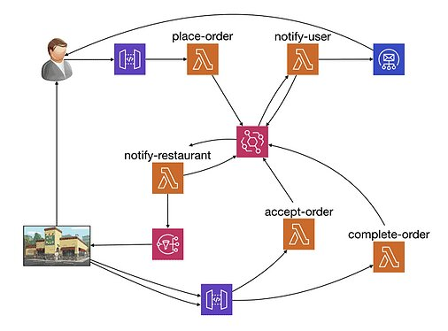

### Production-Ready Serverless 

Place orders and accept/reject them done with Serverless Framework using AWS Lambda, API Gateway, DynamoDB, EventBridge, SNS, Cognito, SSM & SQS
<br /><br />

<p align="center">
  
</p> 

[▶️ Demo site](https://8k6h.short.gy/prsls)

1. Register
1. Place orders clicking in restaurants
1. Simulate restaurant response accepting or rejecting them curling like this:

    ```shell script
    URL=https://8k6h.short.gy/prsls/order/acceptance
    ORDER=<your order>
    ACCEPTANCE=<order_accepted || order_rejected> 
    curl -d '{"orderId":"'"${ORDER}"'", "acceptance":"'"${ACCEPTANCE}"'"}' -H "Content-Type: application/json" -X POST $URL
    ```
1. In the case you accepted the order you can complete it
1. Once you complete or reject the order you can delete it curling like this:
   ```shell script
   ENDPOINT=https://8k6h.short.gy/prsls/order/delete
   ORDER=<your order>
   curl --request GET \
     --url $ENDPOINT/$ORDER
   ```
   
#### Deployment instructions

1. Use Node 12 version as in lambdas and [pipeline](.github/workflows), using [nvm](https://github.com/nvm-sh/nvm) you can:

    ```
    # set Node 12 in current terminal
    nvm use 12
    # set Node 12 as default (new terminals will use 12)
    nvm alias default 12
    ```
   
1. Install dependencies and deploy on your stage (provided you configured your AWS credentials)

    ```shell script
    npm ci
    # deploy on dev stage
    npm run sls -- deploy
    # ...to deploy on prod stage
    npm run sls -- deploy -s prod
    ```

1. Configure these parameters in `AWS Systems Manager > Parameter Store`:

    `/prsls/${stage}/get-restaurants/config`: 
    ```json
    {
       "defaultResults": 8
    }
    ```
    `/prsls/${stage}/search-restaurants/config`:
    ```json
    {
       "defaultResults": 8
    }
    ```

1. Populate the database with restaurants:

    ```shell script
    export restaurants_table=<DynamoDB table for the stage>
    node -e 'require("./tests/steps/given.js").eight_initial_restaurants()'
    ```